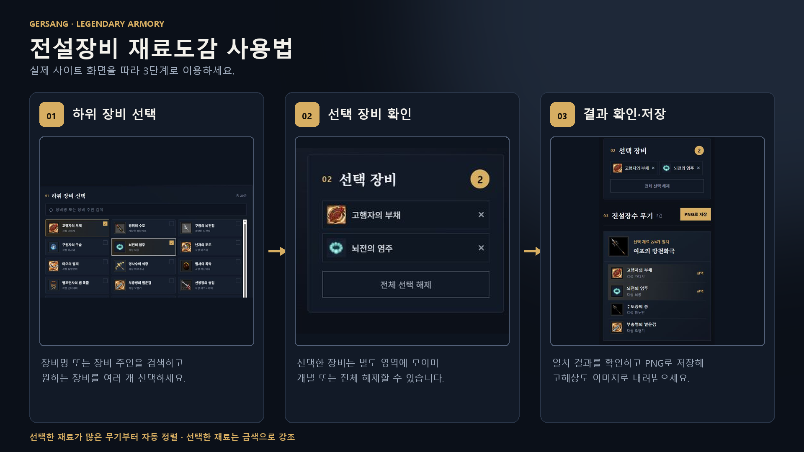

# 거상 전설장비 재료도감

하위 장비로 전설장수 무기를 찾고, 전설장수 장비의 제작·강화 재료와 확률 기대 소모량을 계산하는 정적 웹사이트입니다.

## 사이트 사용법



## 핵심 기능

- 장수 전용 아이템 복수 선택
- 선택한 아이템을 사용하는 전설장수 및 전용 무기 표시
- 중복 전설장수 결과 병합
- 실제 전설장수 무기·하위 장비 아이콘 표시
- 전설장수 무기는 게임 AGF 원본에서 추출한 로컬 아이콘 사용
- 하위 장수 장비 29종도 게임 AGF 원본에서 추출한 로컬 PNG 사용
- 선택 결과를 PNG 이미지로 저장
- 모바일·PC 반응형 화면
- 전설장수 장비 90종 이름·장수·부위 검색
- 전설장수 초상화를 선택해 해당 장수 장비만 필터링
- 장수별 장비를 무기·투구·갑옷·팔보호구·요대·신발 순서로 표시
- `제작만`, `제작부터 1~10강`, `현재 강화 단계부터 목표 강화 단계` 계산
- 장수를 선택하면 투구·무기·갑옷·팔보호구·요대·신발을 실제 장착 위치 형태로 배치
- 단계별 성공 확률, 최소 재료, 확률상 기대 재료 및 강화비 표시
- 제작 재료와 강화 재료를 분리해 표시하고 제작 재료별 아이템명 복사 지원

## 데이터 범위

- 전설장수 15명
- 전설장수 전용 무기 15종
- 중복 제거된 하위 전용 장비 29종
- 기본 무기와 봉인된 힘의 조각은 선택 대상에서 제외
- ZIP에서 확인한 전설장수 장비 및 로컬 아이콘 90종
- 공개 자료에서 제작 및 1~10강 조합식을 확인한 장비 90종

## 강화 계산 기준

- 무기·투구·갑옷: 1강부터 순서대로 40%, 30%, 20%, 15%, 10%
- 팔보호구·요대·신발: 60%, 45%, 30%, 25%, 15%
- 5→10강: 무기·투구·갑옷은 각 단계 10%, 팔보호구·요대·신발은 각 단계 15%
- 최소 재료는 각 단계를 한 번에 성공하는 경우입니다.
- 기대 재료는 실패할 때 재료와 비용이 소모되고 같은 단계에서 재시도한다는 가정으로 `단계 재료 ÷ 성공확률`을 합산한 통계적 평균입니다.
- 실제 결과는 확률에 따라 달라질 수 있으며, 게임 패치나 공식 공지 변경 시 데이터를 다시 확인해야 합니다.

## 권장 화면 흐름

1. 하위 장비 목록에서 아이템을 여러 개 선택합니다.
2. 선택된 아이템을 재료로 사용하는 전설장수 무기가 자동으로 표시됩니다.
3. 결과 카드에는 전설장수 무기 이미지, 무기명, 선택된 하위 장비가 표시됩니다.
4. `이미지로 저장` 버튼을 누르면 현재 결과를 PNG로 내려받습니다.

## 이관 자료

- `assets/item-icons/`: 실제 장비 아이콘
- `references/거상_전설장수_무기_하위재료.png`: 전체 관계표 이미지
- `references/source/`: 아이콘 수집 및 표 생성 과정의 참고 자료

## 저장소명

`gersang-legendary-materials`

## 실행 방법

Node.js 20 이상이 필요합니다.

```bash
npm install
npm run dev
```

표시된 로컬 주소로 접속한 뒤 하위 장비를 복수 선택합니다. 결과 영역의 `PNG로 저장` 버튼은 현재 일치 결과만 2배 해상도의 PNG로 직접 렌더링합니다.

## 빌드 및 테스트

```bash
npm test
npm run build
npm run preview
```

`docs/` 디렉터리가 GitHub Pages용 정적 HTML 결과물입니다. 저장소에 `docs/`를 함께 커밋한 뒤 GitHub 저장소의 **Settings → Pages → Build and deployment**에서 `Deploy from a branch`, 브랜치 `main`, 폴더 `/docs`를 선택하면 됩니다.

`base: './'` 상대 경로 설정이 적용되어 있어 `https://사용자명.github.io/저장소명/` 같은 하위 경로에서도 별도 수정 없이 아이콘과 스크립트가 로드됩니다.

## 주요 구조

- `src/data.js`: 29개 하위 장비와 15개 전설장수 무기의 관계 데이터
- `src/equipmentData.json`: 전설장수 장비별 제작·강화 재료 데이터
- `src/equipmentCalculator.js`: 구간별 최소·기대 재료 계산 로직
- `src/EquipmentCalculator.jsx`: 장비 검색 및 제작·강화 계산 UI
- `src/main.jsx`: 검색, 복수 선택, 결과 필터링 UI
- `src/exportImage.js`: 로컬 아이콘 기반 고해상도 PNG 렌더러
- `src/styles.css`: PC·모바일 반응형 디자인
- `assets/item-icons/`: 전설 무기 및 하위 장비 로컬 아이콘 (`vite.config.js`에서 정적 자산 원본으로 지정)
- `assets/equipment-icons/`: ZIP에서 가져온 전설장수 장비 로컬 아이콘
- `assets/legendary-portraits/`: 게임 AGF 원본에서 추출한 전설장수 큰·작은 초상화 30장
- `references/source/build_equipment_data.py`: 자료 페이지를 구조화 데이터로 변환하는 재생성 스크립트
